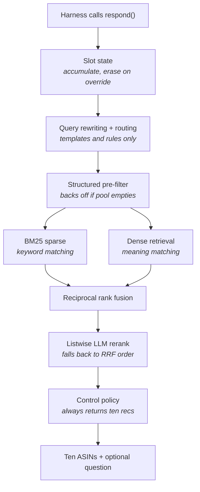

# AGENT.md

Build guide for the TikTok TechJam 2026 Track 4 submission: a conversational retrieval agent over a 50,000-item Amazon catalog.

This is the single source of truth. Two people, roughly 50 working hours.

---

## 1. Hard rules

**Never edit these.** They are organizer-frozen. Editing them invalidates the run.

| Path | Why |
|---|---|
| `evaluator/` | Official scorer. Modifying it is explicitly disallowed |
| `data/` | Frozen catalog and public sessions. Read-only, no mutations, no mock ASIN injection |
| `docs/` | Contract and config. Authoritative reference |

**Never commit:** the evaluator, the catalog, any `*.jsonl`, `.env`, API keys, or model weights.

**Never do:** fine-tune or train any model. Deploy an external vector database. Add Redis or any external datastore. Add LangChain, LlamaIndex, or any agent framework. Build a web UI. Exceed 10 turns in a session.

**Before every commit:**
```bash
git log -p | grep -iE "api_key|sk-|AIza|gsk_"
```
A committed key is a disqualification risk.

---

## 2. What is being built

A **conversational retrieval agent**. A simulated shopper describes a product across multiple turns; the agent must surface the exact product they purchased into a ranked top-10, as high as possible, as early as possible, within 10 turns.

Five moving parts:

1. **Remember** — a dict of accumulated constraints
2. **Search** — keyword and meaning, merged
3. **Sort** — rerank the finalists
4. **Ask** — a clarification question when still uncertain
5. **Repeat** — up to 10 turns

**What this is not.** Not RAG (nothing is generated as the deliverable — output is a ranked list of ASINs scored against an answer key). Not a training project (zero gradient updates). Not an autonomous agent (control flow is hand-written and deterministic). Not a UI project (explicitly out of scope, evaluated headless).

The field is **conversational information retrieval**, a recognized research area with published benchmarks (TREC CAsT, 2019–2022).

### LLM API usage is permitted

Confirmed in two places:

- Problem statement: the kit supports *"local models, and external model APIs"*. Teams using external services are responsible for their own credentials, usage limits, and costs, and must not publish secrets.
- Submission rules: *"Teams may prototype with any legally accessible LLM API or local model during development."*

Banned is **training or full-parameter fine-tuning** of foundation models, not calling them.

One caveat: the submission rules state that for official final scoring, organizer policy **may disable network access**. The submission must therefore document its network requirement and degrade gracefully. See §7.

---

## 3. Scoring

```
TechnicalScore = 0.50 × HitRate@10 + 0.30 × MRR + 0.20 × Efficiency
Efficiency     = clip((11 - MTTC) / 10, 0, 1)
```

- **Hit@10** — was the target in the returned top 10
- **MRR** — reciprocal of its rank (1st = 1.0, 5th = 0.2)
- **MTTC** — mean turn at which the target *first* appeared. A miss counts as turn 11

**Baseline to beat:** `Hit@10 = 0.125`, `MRR = 0.068034`, `MTTC = 9.81`

### The arithmetic that drives all prioritization

Misses are assigned turn 11. Working backwards from the baseline:

```
0.875 × 11        = 9.625
9.81 - 9.625      = 0.185
0.185 / 0.125     = 1.48   ← average turn when it does hit
```

The starter already recommends from turn 1 and hits at turn ~1.5 when it hits at all. Its MTTC of 9.81 is driven almost entirely by an 87.5% miss rate, not by conversational inefficiency.

**Consequence: Efficiency is close to a linear function of Hit Rate.** Improving recall improves all three metrics simultaneously. There is no meaningful accuracy-versus-turn-count tradeoff. Roughly 70% of achievable score is retrieval quality.

**When unsure what to work on, work on retrieval.**

### Human judging

65% of the overall hackathon score is human-judged: Technical Execution 35%, Innovation 20%, Impact 20%, Feasibility 15%, Presentation 10%. Eight hours are reserved for README, tables, and video. Not negotiable.

---

## 4. Architecture



Person B owns: slot state, query rewriting, routing, control policy, guardrails, tracing, evaluation tooling.
Person A owns: pre-filter, BM25, dense retrieval, fusion, reranking, index building.

**Note on routes.** The problem statement describes keyword, category, and vector as three retrieval routes. Mechanically, category is not a retriever — it produces a set, not a ranking, so it has no rank positions to feed into fusion. It is an upstream filter. Two ranked routes go into RRF.

---

## 5. Working in parallel

One seam, agreed in Phase 0 and frozen:

```python
# submission/src/retrieval/interface.py
def retrieve(query: str, slots: "SlotState", track: str, top_k: int) -> list[str]:
    """Ranked parent_asins, best first. Never returns an empty list."""
```

Person B stubs it with the starter's BM25 on hour 3. Person A builds the real implementation behind it and never opens `agent.py`.

**Rules**
1. Person B does not edit `src/retrieval/`. Person A does not edit `agent.py`.
2. `SlotState` fields are frozen after Phase 0. A change is a conversation, not a commit.
3. Separate branches, merge at the marked checkpoints.
4. Both run the evaluator independently. Neither waits for the other to measure.

**Ownership and metrics**

| | Person A | Person B |
|---|---|---|
| Owns | `index_build.py`, `src/retrieval/` | `agent.py`, `src/dialog/`, `src/obs/`, `eval_tools/`, `tests/` |
| Metric | Hit@10, recall@500 | MTTC, zero crashed sessions |

Person B's core work finishes around hour 26 while A is still tuning. That is expected and is an advantage: B picks up README and video from hour 30. One person owning presentation from day two beats both scrambling at hour 46.

---

## 6. File layout

Fork `TechJam2026/techjam-conversational-search`. Work in a `submission/` directory matching the layout in the submission rules.

```
techjam-conversational-search/        ← the fork
├── data/                             ← FROZEN, gitignored
├── evaluator/                        ← FROZEN, never edit
├── docs/                             ← reference
│   ├── agent_api_contract.json
│   └── evaluation_config.json
├── starter/                          ← original weak agent, leave intact
└── submission/                       ← everything you build
    ├── agent.py                      exports class Agent
    ├── requirements.txt              exact pinned versions
    ├── README.md
    ├── .env.example
    ├── setup.sh
    ├── src/
    │   ├── index_build.py            offline: download weights, build indexes
    │   ├── retrieval/
    │   │   ├── interface.py          retrieve() — the frozen seam
    │   │   ├── sparse.py             BM25
    │   │   ├── dense.py              embeddings + cosine
    │   │   ├── fusion.py             RRF
    │   │   ├── filters.py            pre-filter with recall guard
    │   │   └── rerank.py             LLM listwise + fallback
    │   ├── dialog/
    │   │   ├── state.py              SlotState
    │   │   ├── route.py              buying vs browsing
    │   │   ├── query.py              slot-based rewriting
    │   │   ├── facets.py             entropy attribute selection
    │   │   └── explain.py            faithful match explanations
    │   └── obs/
    │       ├── trace.py              TurnTrace
    │       └── cache.py              LLM disk cache
    ├── eval_tools/
    │   ├── by_scenario.py            per-scenario metric split
    │   ├── recall.py                 recall@500 diagnostic
    │   └── ablation.py               eval with components toggled
    ├── tests/
    │   ├── test_contract.py
    │   ├── test_override.py
    │   └── test_turn_cap.py
    └── assets/                       gitignored, regenerated by index_build.py
        ├── bge-small/                downloaded weights
        ├── embeddings.npy
        └── bm25_index.pkl
```

**Phase 0 must confirm** how the evaluator resolves the agent path. If it hardcodes `starter/agent.py`, either point it at `submission/` via config, or keep a thin `starter/agent.py` that imports from `submission/`. Do not modify evaluator code to achieve this.

### `.gitignore`

```
data/
evaluator/
docs/
*.jsonl
.env
submission/assets/
results.json
traces/
__pycache__/
.venv/
```

---

## 7. LLM configuration and fallback

### Provider-agnostic

`litellm` selects a provider from the model-string prefix and reads the matching environment variable.

```python
MODEL = os.getenv("RERANK_MODEL", "gemini/gemini-2.0-flash")
```

`.env.example`, committed with empty values:

```bash
# Option A - Gemini (development default, ~1500 req/day free)
RERANK_MODEL=gemini/gemini-2.0-flash
GEMINI_API_KEY=

# Option B - Groq (faster, ~1000 req/day free)
# RERANK_MODEL=groq/llama-3.3-70b-versatile
# GROQ_API_KEY=

# Option C - OpenAI
# RERANK_MODEL=openai/gpt-4o-mini
# OPENAI_API_KEY=
```

### Rate limits change the design

```
200 sessions × up to 10 turns × 1 rerank call = up to 2,000 calls per full eval run
```

That exceeds the daily free-tier allowance of either provider. Four mitigations:

1. **Disk cache from day one**, keyed on prompt hash. Re-running after an unrelated change then costs zero calls. Highest-value mitigation, and it is a decorator.
2. **Rerank selectively.** Only call the LLM when the pool is small enough that reordering could plausibly change the top 10. Reranking 30 candidates drawn from an 8,000-item pool on turn 1 is mostly noise — this is better engineering *and* cheaper.
3. **Iterate on 50 sessions**, full 200 only at gates. Log the subset size so numbers stay comparable.
4. **Handle 429 gracefully.** Falls back, never crashes.

### Fallback

```python
class Reranker:
    def __init__(self):
        self.model  = os.getenv("RERANK_MODEL")
        self.llm_ok = bool(self.model and has_credentials(self.model))
        if not self.llm_ok:
            log.warning("No LLM credentials - using RRF order")

    def rerank(self, query, slots, fused):
        if self.llm_ok:
            try:
                return self._rerank_llm(query, slots, fused[:30])
            except Exception as e:
                log.warning(f"LLM rerank failed ({e}); falling back to RRF")
                self.llm_ok = False        # do not retry for the rest of the run
        return fused[:10]
```

Two decision points. **Startup**: no credentials means RRF order from turn 1, no wasted calls. **Runtime**: the first failure switches permanently. That permanence matters — without it, one rate limit on session 3 costs a timeout on all 197 remaining sessions.

**Default fallback is the RRF order**, which is already computed. No extra model, no extra download. Degrading costs part of the 30% MRR weight, not all of it: the candidate set is identical and only the ordering changes, so Hit@10 (50%) is untouched.

**Do not build a cross-encoder fallback preemptively.** At hour 36, check the ablation: how much did LLM reranking move MRR? A large gap justifies adding `bge-reranker-base` in Phase 4; a small gap means RRF is sufficient and a 280MB model is wasted effort. Decide with data.

### Model weights: download, do not commit

`index_build.py` downloads the encoder; `assets/` is gitignored. No Git LFS.

**Why setup-time network is safe.** The rules require shipping `requirements.txt` and documenting install steps. `pip install -r requirements.txt` needs network. If setup-time network were disabled, no submission could install dependencies and nothing would run. So "may disable network access" refers to **runtime during scoring**. Downloading weights carries the same risk profile as installing any dependency.

Also: allowed contents list "lightweight local assets" — 130MB is not lightweight, and the recommended layout in the rules names no assets directory. GitHub rejects files over 100MB, so committing would mean Git LFS and its 1GB monthly bandwidth quota.

```python
MODEL_DIR = Path("submission/assets/bge-small")
if not MODEL_DIR.exists():
    try:
        SentenceTransformer("BAAI/bge-small-en-v1.5",
                            revision="<pin-a-commit-hash>").save_pretrained(MODEL_DIR)
    except Exception as e:
        raise RuntimeError(
            f"Could not download encoder weights: {e}\n"
            "This step requires network. See README setup section."
        ) from e
```

**Fail loudly.** A download failure must raise clearly, never leave a partially-built index producing bad scores nobody can explain.

**Pin the revision** to a commit hash, not `main`. Unpinned models make results irreproducible later. Most teams skip this; it is worth a README line.

Use `bge-small-en-v1.5`, not `bge-base`: 384 dimensions, ~130MB weights against ~260MB, ~75MB embedding cache against ~150MB. CPU, memory and timeout restrictions apply at scoring.

**In the README, distinguish:** setup-time network (downloading weights once, same as installing dependencies) versus runtime network (LLM API calls per turn, optional, falls back to RRF order).

---

## 8. Components, and the requirements they satisfy

### 8.1 Slot state — `dialog/state.py` — Person B

```python
@dataclass
class SlotState:
    category: str | None = None
    color: str | None = None
    material: str | None = None
    style: str | None = None
    use_case: str | None = None
    brand: str | None = None
    budget: float | None = None
    rejected: list[str] = field(default_factory=list)
```

**Accumulate** — fill empty slots from the new message.

**Override** — detect contradiction, erase, then write.

```python
CONTRADICT = ["actually", "instead", "no wait", "rather than",
              "forget", "not ", "don't want", "scratch that"]

def is_override(msg, slots):
    lexical  = any(c in msg.lower() for c in CONTRADICT)
    conflict = any(slots.get(k) and slots.get(k) != v
                   for k, v in extract(msg).items())
    return lexical or conflict
```

Two signals, because either alone misses cases: "I want flats" with `style="boots"` already set is an override with no cue word.

**Erasure rule:** clear the conflicting slot. **If `category` changes, clear everything** — the other constraints were chosen for the old category. Push the abandoned value onto `rejected`. Invalidate the candidate pool; last turn's candidates are wrong.

**Why this matters more than it looks.** A broken override tracker degrades the score silently. No error is raised — the numbers are just quietly worse, and the instinct is to blame retrieval.

> **Requirement:** Pillar II, "Dynamic State Machine... Information Accumulation (incremental slots) and abrupt Intent Override (slot erasure and rewriting)." Intent Override is one of four tested scenario types.

**Concepts to research:** task-oriented dialogue systems, slot filling, dialogue state tracking. MultiWOZ (Budzianowski et al., EMNLP 2018) is the canonical benchmark. Pre-LLM architecture, unchanged by LLMs — only extraction got easier.

### 8.2 Intent routing — `dialog/route.py` — Person B

```python
if track == "buying":
    weights, min_pool = [1.0, 0.5], 100      # keyword-leaning, filter hard
else:
    weights, min_pool = [0.5, 1.0], 2000     # meaning-leaning, barely filter
```

Classify with rules: numeric signals (prices, sizes), brand tokens, count of filled slots. Three or more filled slots implies buying.

Buying turns contain hard facts and reward precision. Browsing turns contain intent language and reward semantic breadth and cross-category matching.

**Same pipeline, different parameters. Do not build two pipelines.** "Instantly" in the spec means detect in code, not via an API call.

> **Requirement:** Pillar I, "Dual-Track Routing... high-precision filter track for targeted Buying... diverse dense retrieval track for open-ended Browsing."

### 8.3 Query rewriting — `dialog/query.py` — Person B

```python
def rewrite(history, slots):
    parts = [slots.color, slots.material, slots.style,
             slots.category, slots.use_case]
    return " ".join(p for p in parts if p) or history[-1]
```

Retrievers have no memory. Passing them "the black ones" produces garbage because the referent is two turns back. Template-based: free, deterministic, no LLM call.

> **Requirement:** Pillar II, multi-turn scenario evolution. Also serves Pillar III context distillation.

**Concepts to research:** conversational query rewriting, anaphora and ellipsis resolution. This was the central technique in TREC CAsT winning systems.

### 8.4 Structured pre-filter — `retrieval/filters.py` — Person A

```python
survivors = apply_filters(catalog, slots)
if len(survivors) < MIN_POOL:
    survivors = catalog          # constraint too aggressive, back off
```

**Highest-severity silent failure in the system.** If the user says "boots" and the catalog literal is `Ankle & Bootie`, an unguarded filter deletes the target permanently and no downstream ranking recovers it.

**Must measure:** recall@500 with filters on and off across the dev set. If filtering lowers recall, disable it and let the reranker handle constraints softly.

> **Requirement:** Pillar I, high-precision filter track for Buying.

### 8.5 Sparse retrieval — `retrieval/sparse.py` — Person A

BM25 over `title + category`. Excellent on literal terms: brands, model numbers, materials. Amazon titles are keyword-dense, which suits BM25. Blind to synonyms and intent.

Time the starter's pure-Python implementation before swapping to `bm25s` — 50,000 short documents may be fast enough. If you do swap, **re-run the baseline immediately**, before adding anything else; different tokenization and `k1`/`b` defaults will move the score on the swap alone.

> **Requirement:** Pillar I, keyword route.

**Concepts:** TF-IDF, then BM25 as its probabilistic successor. Inverted index, term saturation, length normalization. Robertson and Walker, Okapi BM25, 1994.

### 8.6 Dense retrieval — `retrieval/dense.py` — Person A

```python
scores = catalog_vectors @ query_vector     # 50k × 384, a few milliseconds
```

**The single largest score improvement available.** The baseline is BM25-only at 0.125. Dense retrieval catches semantic matches with zero lexical overlap: "shoes for a rainy commute" retrieves waterproof boots.

Use an **instruction-tuned** model with a task prefix ("Represent this shopping query for retrieving product listings:"). A one-line change with a measurable gain that most people do not know to make.

**No FAISS, no vector database.** The spec bans external vector DB clusters, and at 50k vectors brute force is also simply correct — approximate indexes earn their complexity around a million vectors. Record this reasoning in the README; it is a better answer than naming a vector store.

**Field ablation, 20 minutes, worth it.** Build three index variants — title only, title + category, title + category + description — and compare recall@500. Amazon descriptions are frequently marketing noise that dilutes the title signal.

> **Requirement:** Pillar I, "diverse dense retrieval track... cross-category scenario matching."

**Concepts:** word then sentence embeddings, cosine similarity, bi-encoder architecture, contrastive training. Reimers and Gurevych, *Sentence-BERT*, EMNLP 2019 (arXiv:1908.10084) — the foundational paper and the one to read if you read only one.

### 8.7 Reciprocal rank fusion — `retrieval/fusion.py` — Person A

```python
from collections import defaultdict

def rrf(ranked_lists, k=60, weights=None):
    weights = weights or [1.0] * len(ranked_lists)
    scores = defaultdict(float)
    for lst, w in zip(ranked_lists, weights):
        for rank, asin in enumerate(lst, start=1):
            scores[asin] += w / (k + rank)
    return sorted(scores, key=scores.get, reverse=True)
```

BM25 scores and cosine similarities live on incompatible scales, so averaging is meaningless. RRF discards scores and uses only rank positions. Items ranked highly by two methods that fail differently are strong candidates precisely because the methods disagree elsewhere.

Use `k=60`. Do not tune it.

> **Requirement:** Pillar I, "Multi-Route Retrieval → LLM Semantic Ranking."

**Source:** Cormack, Clarke and Büttcher, SIGIR 2009. The default hybrid merge in Elasticsearch, Weaviate and Vespa.

### 8.8 Listwise LLM reranking — `retrieval/rerank.py` — Person A

The retriever is a bi-encoder: query and document encoded separately, fast and precomputable but approximate. A reranker sees both together and reasons jointly. **This is where MRR (30% of score) is won** — moving the target from rank 7 to rank 1 is entirely a reranking problem.

**Listwise, not pointwise.** Scoring candidates one at a time discards relative comparison, which is the whole point of ranking. Show the model a numbered list of ~30 candidates and ask for a reordered list. One call instead of thirty, and better results.

- `temperature=0`
- Prompt with the **slot dict**, not the raw transcript. Structured input works better and costs fewer tokens
- The model will occasionally output an index you did not supply, or skip some. Validate against the candidate list and append anything missing in RRF order

> **Requirement:** Pillar I, LLM Semantic Ranking. Pillar IV, "pushing the exact purchased item to the absolute top."

**Source:** Sun et al., *Is ChatGPT Good at Search? Investigating Large Language Models as Re-Ranking Agents*, EMNLP 2023 (arXiv:2304.09542) — the RankGPT paper.

### 8.9 Control policy — `agent.py` — Person B

```python
def respond(self, session_id, user_message, turn, top_k):
    self.history.append(user_message)

    if is_override(user_message, self.slots):
        erased = self.slots.erase_conflicting(user_message)
        self.pool = None

    self.slots.update(user_message)
    track = route(user_message, self.slots)
    query = rewrite(self.history, self.slots)

    top10 = retrieve(query, self.slots, track, top_k=10)

    ask = None
    if needs_clarification(self.slots, turn) and turn < 9:
        ask = best_facet(self.pool, self.slots.unfilled())

    return {
        "message": phrase(ask) if ask else None,
        "ask_attribute": ask,
        "recommendations": [{"parent_asin": a} for a in top10],
        "usage": self.tokens.dump(),
    }
```

**Always return 10 recommendations, every turn, from turn 1, even at zero confidence.** The contract permits asking and recommending in the same response, and MTTC records the *first* turn the target appears. Recommending is free; every turn is a free attempt. An empty list is a guaranteed miss.

The starter already does this — preserve the behaviour rather than rebuilding it.

> **Requirement:** Pillar II, retrieval cutoff on over-generality. Pillar IV, MTTC.

### 8.10 Entropy-based clarification — `dialog/facets.py` — Person B

```python
def best_facet(candidates, unfilled_attrs):
    best, best_H = None, -1
    for attr in unfilled_attrs:              # from the contract enum only
        p = candidates[attr].value_counts(normalize=True)
        H = -(p * np.log2(p)).sum()          # Shannon entropy
        if H > best_H:
            best, best_H = attr, H
    return best
```

If the pool is 45% black / 30% brown / 25% other on colour but 92% leather on material, asking about colour eliminates far more. Colour might cut 600 → 40; material would cut 600 → 550 and waste a turn.

Ask with concrete options taken from values actually in the pool — "black, brown, or something brighter?" — so the answer is parseable and no attribute with zero remaining options is ever asked about.

**Phrase with a template, not an LLM:**

```python
def phrase(attr, top_values):
    return f"Any preference on {attr}? For example: {', '.join(top_values[:3])}."
```

The choice of what to ask is deterministic and explainable.

**Honest scope note.** Direct score impact is modest, because misses dominate MTTC. The value is concentrated in Innovation (20% of human judging) and in giving the pitch a thesis: *clarification is an active-learning problem, not a prompting problem.*

> **Requirement:** Pillar II, "Proactive Guidance... structured, proactive clarification prompts." Organizers' innovation route: "question value estimation."

**Concepts:** Shannon entropy, information gain as used in decision-tree splitting, active learning and uncertainty sampling. Aliannejadi et al., *Asking Clarifying Questions in Open-Domain Information-Seeking Conversations*, SIGIR 2019 (the Qulac dataset).

### 8.11 Faithful explanations — `dialog/explain.py` — Person B

```python
def explain(product, slots):
    matched = [f"{k}: {v}" for k, v in slots.filled()
               if product_matches(product, k, v)]
    return "matches " + ", ".join(matched[:3])
```

No LLM call. Put it in the **trace**, not the response payload, unless `docs/agent_api_contract.json` clearly permits extra keys — a rejected response shape is worse than no explanation.

Three payoffs: a debugging tool (if it says "matches colour: black" and the product is brown, extraction is broken), demo legibility, and it covers the organizers' route. Derived from real matching logic rather than generated post hoc, so it is a *faithful* explanation — worth a README line.

> **Requirement:** Organizers' innovation route: "transparent explanations."

### 8.12 Adaptive parameters — Person B

```python
weights  = WEIGHTS[track]
min_pool = 100 if turn < 5 else 300              # loosen filters late
if self.ignored_asks >= 2: ask = None            # stop asking if ignored
```

Log each rule that fires so adaptation can be demonstrated rather than claimed.

**README framing:** state that "runtime workflow re-orchestration" was interpreted as state-conditioned parameter adaptation rather than LLM self-planning, because a self-modifying pipeline is non-deterministic, hard to debug, costs turns when it wanders, and cannot be explained to a judge asking "why did it do that?" Showing the requirement was read and deliberately scoped is stronger than an unexplainable pipeline.

> **Requirement:** Pillar III, "Adaptive Orchestration... strategy alignment." Organizers' route: "strategy switching."

### 8.13 Profile seeding — Person B

Seed `SlotState` from the `user_profile` dict at `reset()`. **Safety rule: an explicitly stated constraint always beats a profile prior.** If the profile says one brand and the user asks for another, the user wins. Make it a feature flag so it becomes an ablation row.

> **Requirement:** Pillar III, "long-term user profiles." Organizers' route: "safe personalization."

Sessions are isolated single-user with no cross-session persistence. Do not build a user database — there would be nothing to put in it.

### 8.14 Guardrails — Person B

Four rules, roughly 40 lines. Not innovation — insurance. Each prevents a zero.

| Guard | Prevents |
|---|---|
| Turn cap; force `ask = None` at turn 9 | Exceeding 10 turns scores **zero** for that session |
| Never-empty recommendations | A guaranteed miss |
| LLM failure contained in `respond()` | A crash mid-session |
| Validate ASINs exist, dedupe, cap at `top_k` | Silent hit loss from hallucinated IDs |

Only the first 10 **valid unique** ASINs are scored, so duplicates and invalid IDs consume slots. Output validation is load-bearing.

```python
if len(top10) == 0:
    top10 = dense_search(query, top_n=10)     # ignore all filters
```

> **Requirement:** Feasibility and Practicality (15%): "the architecture holds under real-world conditions."

### 8.15 Tracing — `obs/trace.py` — Person B

```python
@dataclass
class TurnTrace:
    turn: int
    slots_erased: list[str]     # makes the override bug visible
    pool_size_pre: int
    pool_size_post: int         # makes over-filtering visible
    facet_chosen: str | None
```

Four fields. Resist adding more. JSONL to `traces/{session_id}.jsonl`. Pretty rendering with `rich` comes in Phase 5, for the video.

### 8.16 Caching — `obs/cache.py` — Person B

Disk-cache LLM responses keyed by prompt hash. The evaluator runs dozens of times; identical calls are wasted money and minutes.

Cache the embedding matrix (`np.save`) and BM25 index (`pickle`) from `index_build.py`. Both regenerate from `index_build.py`, which must be **idempotent** — running it twice must not rebuild, or a judge re-running setup waits five minutes for nothing.

---

## 9. Explicitly not built

Name these in the README's future work section with one line each on why they would help. Naming them well reads as field awareness; building them badly reads worse than not building them.

- **HyDE** — LLM writes a hypothetical product listing, embed that instead of the query. Bridges the gap between how shoppers talk (needs) and how titles are written (attributes). Real technique, but an extra LLM call *before* retrieval, added latency, and a new failure mode: a misleading hypothetical makes retrieval worse. (Gao et al., arXiv:2212.10496)
- **Multi-query fusion** — retrieve for several query variants, fuse. Cheap to build, but more LLM calls for a modest gain.
- **ColBERT / late interaction** — token-level embeddings with MaxSim. Better than a bi-encoder, cheaper than a cross-encoder. Half a day plus a large index. (Khattab and Zaharia, arXiv:2004.12832)
- **SPLADE** — learned sparse retrieval; semantic expansion inside an inverted index. Overlaps with what BM25 + dense already provides.
- **Matryoshka retrieval** — truncatable embeddings for adaptive dimensions. Solves a latency problem that does not exist at 50k items.
- **Self-consistency reranking** — rerank multiple times, aggregate. Triples token cost for marginal gain, and token usage is disclosed.
- **Local generative LLM fallback** — downloading and wiring a local model is a real time sink. Disk caching plus the RRF fallback covers the same risk.
- **Vector database, Redis, LangChain, fine-tuning, web UI** — see §1.

---

## 10. Phases

### Phase 0 — Setup (0–6h). Both together, do not split.

| Task | Why |
|---|---|
| Fork the kit, `uv sync`, Python 3.10+ | — |
| Verify the SHA256 checksum | A truncated catalog fails silently |
| Run the starter, confirm `0.125 / 0.068 / 9.81` | Different numbers mean a broken environment |
| Read `docs/evaluation_config.json` | Confirm score weights |
| Read `docs/agent_api_contract.json` | **Authoritative.** Response shape and `ask_attribute` enum |
| Confirm how the evaluator resolves the agent path | Decides `submission/` wiring. Do not edit evaluator code |
| **Open the catalog and inspect it** | Is `price` a float or `"$24.99 - $31.50"`? Is `color` a field or only in titles? |
| Check whether sessions carry scenario labels | Decides whether the scenario table is possible |
| Inspect the `user_profile` dict from `reset()` | Decides turn-1 strategy |
| Agree `SlotState` fields and `retrieve()` signature | Freeze them |
| **Write `.gitignore` before the first commit** | A committed `data/` needs history rewriting to remove |
| Write the three tests | Contract, turn cap, override |
| Write `make eval` | Runs the evaluator, appends `{git hash, three numbers, note}` to `runs.log` |
| Ask organizers what "network disabled" covers | Setup versus runtime. Webinar and Discord both available |

**Gate:** baseline reproduced exactly. Tests pass. Interface frozen.

**Why six hours.** Catalog inspection decides the slot design. If colour lives only in titles, Person A needs a keyword-extraction pass over 50,000 titles — work to schedule now, not discover at hour 30.

### Phase 1 — State and tooling (6–14h). Split here.

**Person B:** `SlotState` with accumulation and override; override tests; profile seeding; simple clarification (first unfilled attribute — the entropy version comes in Phase 4); control policy in `agent.py`; scenario evaluator; trace logging.

**Person A:** catalog loading and normalization; title attribute extraction if Phase 0 found colour/material are not fields; BM25 index; `retrieve()` shim using BM25 only so B can integrate against real code.

**Gate:** full loop runs end to end. Override test passes. Score at or near baseline — nothing is optimized yet.

### Phase 2 — Retrieval (14–28h). Where the score is.

**Person A:** embedding pipeline with instruction prefix; `index_build.py`; dense search; RRF; pre-filter with recall guard; recall@500 diagnostic.

**Person B:** query rewriting; intent routing; LLM disk cache.

**Gate: Hit@10 must clearly beat 0.125.** If not, stop and debug recall@500. Do not proceed to reranking — there is no point tuning a reranker over a candidate set the target never entered.

**Merge checkpoint.** Run the scenario table.

### Phase 3 — Reranking and guardrails (28–36h)

**Person A:** RankGPT listwise rerank; provider via `RERANK_MODEL`; RRF fallback with permanent switch on first failure.

**Person B:** the four guardrails; `--no-llm` mode.

**Gate:** MRR moved. Zero crashed sessions across 200 dev sessions. `--no-llm` beats baseline.

### Phase 4 — Differentiators (36–42h)

| Build | Time | Note |
|---|---|---|
| Entropy clarification | 3h | The differentiator. Organizers named it |
| Faithful explanations | 45m | Debugging + demo + covers their route |
| Adaptive parameters | 30m | Three if-statements. Covers Pillar III |
| Cross-encoder fallback | 1h | **Only if** the hour-36 ablation shows LLM rerank moves MRR a lot |

**Gate at 42h: feature freeze.** Nothing new after this line.

### Phase 5 — Deliverables (42–50h). 65% of the score.

| Task | Who | Time |
|---|---|---|
| Ablation table (six eval runs) | B | 1h |
| Scenario table | B | 1h if labels exist |
| Failure analysis (read 20 worst sessions) | B | 1h |
| Cost disclosure — latency mean/p95, tokens, est. cost | B | 30m |
| README | A | 2h |
| `setup.sh` + README setup section | A | 30m |
| Demo video (`rich` trace replay) | Both | 2h |
| Submission checklist pass | Both | 30m |
| **Clean clone test** | Both | 1h, at hour 48 |

---

## 11. Commands

```bash
# setup
uv sync                                    # or pip install -r requirements.txt
python submission/src/index_build.py       # downloads weights, builds indexes

# evaluate
python3 -m evaluator.local_evaluator       # writes results.json
make eval                                  # above + appends to runs.log

# test
pytest submission/tests/ -q

# diagnostics
python submission/eval_tools/recall.py         # recall@500 ceiling
python submission/eval_tools/by_scenario.py    # per-scenario split
python submission/eval_tools/ablation.py       # eval with components toggled

# offline check — run this in Phase 2, not Phase 5
unset GEMINI_API_KEY && make eval

# before every commit
git log -p | grep -iE "api_key|sk-|AIza|gsk_"
```

### Key files to reference

| File | Purpose |
|---|---|
| `docs/agent_api_contract.json` | **Authoritative** response schema and `ask_attribute` enum |
| `docs/evaluation_config.json` | Score weights, K value, turn limit |
| `evaluator/local_evaluator.py` | Read to understand scoring. Never edit |
| `starter/agent.py` | Reference implementation of the interface. Leave intact |
| `data/` documentation | Field names and cleanliness. Read before designing slots |

---

## 12. Verification

### Tests, day one

1. **Contract** — construct a response, validate against `docs/agent_api_contract.json`
2. **Turn cap** — all 200 sessions, assert zero violations
3. **Override** — scripted contradiction, assert the old slot is `None`
4. **Determinism** — same session twice, identical output (`temperature=0` + prompt-hash cache)
5. **Recall ceiling** — is the target in the top 500 *before* reranking? The upper bound on Hit@10

Test 5 is the most useful diagnostic in the project.

Test 3 is the one that matters most in practice: most bugs show up in the score, but a broken override does not — it just makes the number quietly worse while you debug the wrong file.

### Debugging order

Never tune the reranker while recall is broken.

| Symptom | Cause | Do not touch |
|---|---|---|
| Recall@500 low | Retrieval: embeddings, fusion, over-filtering | The rerank prompt |
| Hit@10 low, recall fine | Reranker dropping the target | Retrieval |
| MRR low, Hit@10 fine | Reranker ordering: prompt, context | Retrieval |
| MTTC high, Hit@10 fine | Asking too many questions | Anything else |
| One scenario far below others | That scenario's handler | The global pipeline |

**Invariants.** Hit@10 ≥ MRR, always. Recall@500 ≥ Hit@10, always. A violation is a bug.

### The three tables

**Ablation** — six eval runs behind feature flags:

| Config | Hit@10 | MRR | MTTC |
|---|---|---|---|
| BM25 baseline | 0.125 | 0.068 | 9.81 |
| + dense retrieval | | | |
| + RRF | | | |
| + query rewriting | | | |
| + LLM rerank | | | |
| Full system | | | |

Every row should move a number. A row that does not is a component that has not earned its place. This is the strongest available evidence of deliberate decision-making, which Technical Execution (35%) rewards.

If the cross-encoder was built, add a three-way rerank comparison. Reranking reorders the existing top 30 rather than finding new candidates, so **Hit@10 barely moves and MRR is the column that matters.** Reporting that a local cross-encoder came close to RankGPT at zero API cost is a more interesting finding than "we used an LLM."

**Scenario** — the final system split four ways. Not required by the rules; it is a debugging tool. In aggregate a broken override looks like "0.48, could be better." Split, it is a `0.11` beside three healthy numbers. If sessions carry no scenario label, substitute: grep traces for sessions where `slots_erased` fired and check whether those hit.

**Failure analysis** — read the 20 worst sessions and categorize: target never in top 500 (recall), retrieved but buried (ranking), override corrupted state (state bug), ran out of turns (control policy). Then three sentences naming the dominant failure mode and what would fix it. Everyone reports their best number; almost nobody reports where they break.

---

## 13. Submission checklist

### Files
- [ ] `submission/agent.py` exporting `class Agent`
- [ ] `requirements.txt` with **exact pinned versions** (`==`, not `>=`)
- [ ] `README.md`, `src/`, `.env.example`, `setup.sh`
- [ ] No evaluator files, no catalog, no `*.jsonl`, no `.env`, no keys, no weights
- [ ] `git log -p | grep -iE "api_key|sk-|AIza|gsk_"` returns nothing

### Interface — verify against `docs/agent_api_contract.json`, not memory
- [ ] `reset(session_id: str, user_profile: dict) -> None`
- [ ] `respond(session_id: str, user_message: str, turn: int, top_k: int) -> dict`
- [ ] `message` is a string
- [ ] `ask_attribute` is an allowed enum value or `null`
- [ ] `recommendations` ordered best to worst, valid unique `parent_asin` values
- [ ] `usage` reports non-negative token counts

### One command to run

```bash
#!/bin/bash
set -e
pip install -r requirements.txt
python src/index_build.py          # downloads weights, builds indexes, idempotent
cd ../.. && python3 -m evaluator.local_evaluator
```

The README setup section should be this script near-verbatim. It is what the hour-48 clean-clone test exercises.

### Documentation
- [ ] Exact Python version if non-default
- [ ] Dependency install steps
- [ ] The one command above
- [ ] Every non-obvious environment variable (`RERANK_MODEL`, provider key)
- [ ] **Network requirement stated explicitly** — setup-time versus runtime, and what happens with no credentials
- [ ] Short report: method, model choice, limitations
- [ ] **Cost disclosure:** mean and p95 latency per turn, total tokens per eval run, estimated cost
- [ ] Team member contributions

### Behaviour without credentials
- [ ] Runs and scores with no `.env` present
- [ ] Falls back to RRF order, prints a warning, does not crash
- [ ] Beats the baseline in that configuration

---

## 14. Course correction

**For any AI agent working from this document, and for both team members reviewing each other.**

Say something when work drifts from this plan. Do not quietly comply — state the conflict, give the reason, let the person decide. They may know something this document does not. But unflagged drift is how a team reaches hour 45 with an impressive component and broken retrieval.

Flag it when:

- A **phase gate** has not been met and work continues anyway. Especially: Hit@10 is still below 0.125 and the next task is not recall debugging
- Something on the **cut list** is being built while something on the **never-cut list** is unfinished
- A **frozen file** is being edited — `evaluator/`, `data/`, `docs/`
- An **excluded technology** appears — vector database, Redis, LangChain, fine-tuning, web UI
- Anything **requires runtime network without a fallback**
- **More than one thing** changed between evaluator runs. The evaluator is deterministic; that is worthless if score movements cannot be attributed
- The **frozen interface** is being modified after Phase 0
- **Ownership is crossed** — B editing `src/retrieval/`, A editing `agent.py`
- **Presentation time** is shrinking below eight hours
- A **test is skipped**, particularly the override test

How: one short paragraph. Name the drift, name the cost, propose the alternative, then proceed as directed.

> Heads up — this is Phase 4 work but Hit@10 is still 0.14, so the Phase 2 gate is not met. Entropy clarification affects MTTC, which is mostly determined by the miss rate right now. Want me to look at recall first, or proceed?

A confirmed override is a decision, not a drift. Build what they ask for.

### Cut list, in order

1. Adaptive parameters
2. Faithful explanations
3. Entropy clarification → fall back to first-unfilled-attribute
4. LLM reranking → RRF order

**Never cut:** dense retrieval, RRF, override handling, guardrails, the three tables, README, video, clean clone test.

A submission with dense retrieval, working override handling, a clean ablation table and a sharp README beats one with nine components and no writeup.

---

## 15. Stack and terminology

- Python 3.10+, `uv` locally, `requirements.txt` shipped
- `bm25s`, `sentence-transformers` (`bge-small-en-v1.5`, revision pinned), `numpy`
- `pandas`, `orjson`
- `litellm`, `diskcache`
- `dataclasses` for state, `pydantic` for the contract
- `pytest`, `rich`

**No Docker.** The harness imports the `Agent` class in-process. A container would require the organizer to run an image, mount their data in, and extract the class — which the harness does not do. "Code that requires privileged host access" is also disallowed.

### Terminology

**Accurate, defensible under questioning:** conversational information retrieval, hybrid retrieval, reciprocal rank fusion, bi-encoder, cross-encoder reranking, listwise reranking, two-stage retrieval, dialogue state tracking, slot filling, intent classification, conversational query rewriting, clarifying question generation, information gain, MRR, Hit Rate@K, deterministic control policy.

**Avoid:** "RAG" (no generation), "fine-tuned" (no training), "agentic" or "autonomous" (control flow is hand-written), "vector database" (numpy array).

The problem statement's coinages — "Dynamic Context Programming," "Self-Evolution," "Personalized Context Distillation" — belong in the submission where requirements map to components, but not in external portfolio material where they carry no recognized meaning.

**Positioning line:**

> A multi-turn conversational retrieval system over a 50K-item catalog. Two-stage pipeline: hybrid sparse–dense first-stage retrieval with reciprocal rank fusion, followed by listwise LLM reranking. Dialogue state tracking handles constraint accumulation and intent override; a deterministic control policy selects clarification attributes by information gain.
