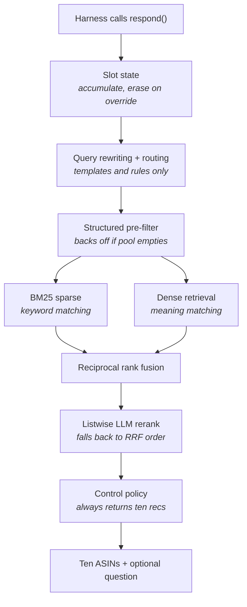

# DESIGN.md

Why each component exists, which hackathon requirement it satisfies, and what to research to understand it. Reference material — consult when building a component, not on every task.

Part of a set: `AGENTS.md` (always-loaded rules and commands), `PLAN.md` (roadmap and gates), `DESIGN.md` (component rationale and research), `SUBMISSION.md` (packaging and rules).

---

## What is being built

A **conversational retrieval agent**. A simulated shopper describes a product across multiple turns; the agent must surface the exact product they purchased into a ranked top-10, as high as possible, as early as possible, within 10 turns.

Five moving parts:

1. **Remember** — a dict of accumulated constraints
2. **Search** — keyword and meaning, merged
3. **Sort** — rerank the finalists
4. **Ask** — a clarification question when still uncertain
5. **Repeat** — up to 10 turns

**What this is not.** Not RAG (nothing is generated as the deliverable — output is a ranked list of ASINs scored against an answer key). Not a training project (zero gradient updates). Not an autonomous agent (control flow is hand-written and deterministic). Not a UI project (explicitly out of scope, evaluated headless).

The field is **conversational information retrieval**, a recognized research area with published benchmarks (TREC CAsT, 2019–2022).

### LLM API usage is permitted

Confirmed in two places:

- Problem statement: the kit supports *"local models, and external model APIs"*. Teams using external services are responsible for their own credentials, usage limits, and costs, and must not publish secrets.
- Submission rules: *"Teams may prototype with any legally accessible LLM API or local model during development."*

Banned is **training or full-parameter fine-tuning** of foundation models, not calling them.

One caveat: the submission rules state that for official final scoring, organizer policy **may disable network access**. The submission must therefore document its network requirement and degrade gracefully. See `SUBMISSION.md`.

---

---

## Architecture



Person B owns: slot state, query rewriting, routing, control policy, guardrails, tracing, evaluation tooling.
Person A owns: pre-filter, BM25, dense retrieval, fusion, reranking, index building.

**Note on routes.** The problem statement describes keyword, category, and vector as three retrieval routes. Mechanically, category is not a retriever — it produces a set, not a ranking, so it has no rank positions to feed into fusion. It is an upstream filter. Two ranked routes go into RRF.

---

---

## Components, and the requirements they satisfy

### Slot state — `dialog/state.py` — Person B

```python
@dataclass
class SlotState:
    category: str | None = None
    color: str | None = None
    material: str | None = None
    style: str | None = None
    use_case: str | None = None
    brand: str | None = None
    budget: float | None = None
    rejected: list[str] = field(default_factory=list)
```

**Accumulate** — fill empty slots from the new message.

**Override** — detect contradiction, erase, then write.

```python
CONTRADICT = ["actually", "instead", "no wait", "rather than",
              "forget", "not ", "don't want", "scratch that"]

def is_override(msg, slots):
    lexical  = any(c in msg.lower() for c in CONTRADICT)
    conflict = any(slots.get(k) and slots.get(k) != v
                   for k, v in extract(msg).items())
    return lexical or conflict
```

Two signals, because either alone misses cases: "I want flats" with `style="boots"` already set is an override with no cue word.

**Erasure rule:** clear the conflicting slot. **If `category` changes, clear everything** — the other constraints were chosen for the old category. Push the abandoned value onto `rejected`. Invalidate the candidate pool; last turn's candidates are wrong.

**Why this matters more than it looks.** A broken override tracker degrades the score silently. No error is raised — the numbers are just quietly worse, and the instinct is to blame retrieval.

> **Requirement:** Pillar II, "Dynamic State Machine... Information Accumulation (incremental slots) and abrupt Intent Override (slot erasure and rewriting)." Intent Override is one of four tested scenario types.

**Concepts to research:** task-oriented dialogue systems, slot filling, dialogue state tracking. MultiWOZ (Budzianowski et al., EMNLP 2018) is the canonical benchmark. Pre-LLM architecture, unchanged by LLMs — only extraction got easier.

### Intent routing — `dialog/route.py` — Person B

```python
if track == "buying":
    weights, min_pool = [1.0, 0.5], 100      # keyword-leaning, filter hard
else:
    weights, min_pool = [0.5, 1.0], 2000     # meaning-leaning, barely filter
```

Classify with rules: numeric signals (prices, sizes), brand tokens, count of filled slots. Three or more filled slots implies buying.

Buying turns contain hard facts and reward precision. Browsing turns contain intent language and reward semantic breadth and cross-category matching.

**Same pipeline, different parameters. Do not build two pipelines.** "Instantly" in the spec means detect in code, not via an API call.

> **Requirement:** Pillar I, "Dual-Track Routing... high-precision filter track for targeted Buying... diverse dense retrieval track for open-ended Browsing."

### Query rewriting — `dialog/query.py` — Person B

```python
def rewrite(history, slots):
    parts = [slots.color, slots.material, slots.style,
             slots.category, slots.use_case]
    return " ".join(p for p in parts if p) or history[-1]
```

Retrievers have no memory. Passing them "the black ones" produces garbage because the referent is two turns back. Template-based: free, deterministic, no LLM call.

> **Requirement:** Pillar II, multi-turn scenario evolution. Also serves Pillar III context distillation.

**Concepts to research:** conversational query rewriting, anaphora and ellipsis resolution. This was the central technique in TREC CAsT winning systems.

### Structured pre-filter — `retrieval/filters.py` — Person A

```python
survivors = apply_filters(catalog, slots)
if len(survivors) < MIN_POOL:
    survivors = catalog          # constraint too aggressive, back off
```

**Highest-severity silent failure in the system.** If the user says "boots" and the catalog literal is `Ankle & Bootie`, an unguarded filter deletes the target permanently and no downstream ranking recovers it.

**Must measure:** recall@500 with filters on and off across the dev set. If filtering lowers recall, disable it and let the reranker handle constraints softly.

> **Requirement:** Pillar I, high-precision filter track for Buying.

### Sparse retrieval — `retrieval/sparse.py` — Person A

BM25 over `title + category`. Excellent on literal terms: brands, model numbers, materials. Amazon titles are keyword-dense, which suits BM25. Blind to synonyms and intent.

Time the starter's pure-Python implementation before swapping to `bm25s` — 50,000 short documents may be fast enough. If you do swap, **re-run the baseline immediately**, before adding anything else; different tokenization and `k1`/`b` defaults will move the score on the swap alone.

> **Requirement:** Pillar I, keyword route.

**Concepts:** TF-IDF, then BM25 as its probabilistic successor. Inverted index, term saturation, length normalization. Robertson and Walker, Okapi BM25, 1994.

### Dense retrieval — `retrieval/dense.py` — Person A

```python
scores = catalog_vectors @ query_vector     # 50k × 384, a few milliseconds
```

**The single largest score improvement available.** The baseline is BM25-only at 0.125. Dense retrieval catches semantic matches with zero lexical overlap: "shoes for a rainy commute" retrieves waterproof boots.

Use an **instruction-tuned** model with a task prefix ("Represent this shopping query for retrieving product listings:"). A one-line change with a measurable gain that most people do not know to make.

**No FAISS, no vector database.** The spec bans external vector DB clusters, and at 50k vectors brute force is also simply correct — approximate indexes earn their complexity around a million vectors. Record this reasoning in the README; it is a better answer than naming a vector store.

**Field ablation, 20 minutes, worth it.** Build three index variants — title only, title + category, title + category + description — and compare recall@500. Amazon descriptions are frequently marketing noise that dilutes the title signal.

> **Requirement:** Pillar I, "diverse dense retrieval track... cross-category scenario matching."

**Concepts:** word then sentence embeddings, cosine similarity, bi-encoder architecture, contrastive training. Reimers and Gurevych, *Sentence-BERT*, EMNLP 2019 (arXiv:1908.10084) — the foundational paper and the one to read if you read only one.

### Reciprocal rank fusion — `retrieval/fusion.py` — Person A

```python
from collections import defaultdict

def rrf(ranked_lists, k=60, weights=None):
    weights = weights or [1.0] * len(ranked_lists)
    scores = defaultdict(float)
    for lst, w in zip(ranked_lists, weights):
        for rank, asin in enumerate(lst, start=1):
            scores[asin] += w / (k + rank)
    return sorted(scores, key=scores.get, reverse=True)
```

BM25 scores and cosine similarities live on incompatible scales, so averaging is meaningless. RRF discards scores and uses only rank positions. Items ranked highly by two methods that fail differently are strong candidates precisely because the methods disagree elsewhere.

Use `k=60`. Do not tune it.

> **Requirement:** Pillar I, "Multi-Route Retrieval → LLM Semantic Ranking."

**Source:** Cormack, Clarke and Büttcher, SIGIR 2009. The default hybrid merge in Elasticsearch, Weaviate and Vespa.

### Listwise LLM reranking — `retrieval/rerank.py` — Person A

The retriever is a bi-encoder: query and document encoded separately, fast and precomputable but approximate. A reranker sees both together and reasons jointly. **This is where MRR (30% of score) is won** — moving the target from rank 7 to rank 1 is entirely a reranking problem.

**Listwise, not pointwise.** Scoring candidates one at a time discards relative comparison, which is the whole point of ranking. Show the model a numbered list of ~30 candidates and ask for a reordered list. One call instead of thirty, and better results.

- `temperature=0`
- Prompt with the **slot dict**, not the raw transcript. Structured input works better and costs fewer tokens
- The model will occasionally output an index you did not supply, or skip some. Validate against the candidate list and append anything missing in RRF order

> **Requirement:** Pillar I, LLM Semantic Ranking. Pillar IV, "pushing the exact purchased item to the absolute top."

**Source:** Sun et al., *Is ChatGPT Good at Search? Investigating Large Language Models as Re-Ranking Agents*, EMNLP 2023 (arXiv:2304.09542) — the RankGPT paper.

### Control policy — `agent.py` — Person B

```python
def respond(self, session_id, user_message, turn, top_k):
    self.history.append(user_message)

    if is_override(user_message, self.slots):
        erased = self.slots.erase_conflicting(user_message)
        self.pool = None

    self.slots.update(user_message)
    track = route(user_message, self.slots)
    query = rewrite(self.history, self.slots)

    top10 = retrieve(query, self.slots, track, top_k=10)

    ask = None
    if needs_clarification(self.slots, turn) and turn < 9:
        ask = best_facet(self.pool, self.slots.unfilled())

    return {
        "message": phrase(ask) if ask else None,
        "ask_attribute": ask,
        "recommendations": [{"parent_asin": a} for a in top10],
        "usage": self.tokens.dump(),
    }
```

**Always return 10 recommendations, every turn, from turn 1, even at zero confidence.** The contract permits asking and recommending in the same response, and MTTC records the *first* turn the target appears. Recommending is free; every turn is a free attempt. An empty list is a guaranteed miss.

The starter already does this — preserve the behaviour rather than rebuilding it.

> **Requirement:** Pillar II, retrieval cutoff on over-generality. Pillar IV, MTTC.

### Entropy-based clarification — `dialog/facets.py` — Person B

```python
def best_facet(candidates, unfilled_attrs):
    best, best_H = None, -1
    for attr in unfilled_attrs:              # from the contract enum only
        p = candidates[attr].value_counts(normalize=True)
        H = -(p * np.log2(p)).sum()          # Shannon entropy
        if H > best_H:
            best, best_H = attr, H
    return best
```

If the pool is 45% black / 30% brown / 25% other on colour but 92% leather on material, asking about colour eliminates far more. Colour might cut 600 → 40; material would cut 600 → 550 and waste a turn.

Ask with concrete options taken from values actually in the pool — "black, brown, or something brighter?" — so the answer is parseable and no attribute with zero remaining options is ever asked about.

**Phrase with a template, not an LLM:**

```python
def phrase(attr, top_values):
    return f"Any preference on {attr}? For example: {', '.join(top_values[:3])}."
```

The choice of what to ask is deterministic and explainable.

**Honest scope note.** Direct score impact is modest, because misses dominate MTTC. The value is concentrated in Innovation (20% of human judging) and in giving the pitch a thesis: *clarification is an active-learning problem, not a prompting problem.*

> **Requirement:** Pillar II, "Proactive Guidance... structured, proactive clarification prompts." Organizers' innovation route: "question value estimation."

**Concepts:** Shannon entropy, information gain as used in decision-tree splitting, active learning and uncertainty sampling. Aliannejadi et al., *Asking Clarifying Questions in Open-Domain Information-Seeking Conversations*, SIGIR 2019 (the Qulac dataset).

### Faithful explanations — `dialog/explain.py` — Person B

```python
def explain(product, slots):
    matched = [f"{k}: {v}" for k, v in slots.filled()
               if product_matches(product, k, v)]
    return "matches " + ", ".join(matched[:3])
```

No LLM call. Put it in the **trace**, not the response payload, unless `docs/agent_api_contract.json` clearly permits extra keys — a rejected response shape is worse than no explanation.

Three payoffs: a debugging tool (if it says "matches colour: black" and the product is brown, extraction is broken), demo legibility, and it covers the organizers' route. Derived from real matching logic rather than generated post hoc, so it is a *faithful* explanation — worth a README line.

> **Requirement:** Organizers' innovation route: "transparent explanations."

### Adaptive parameters — Person B

```python
weights  = WEIGHTS[track]
min_pool = 100 if turn < 5 else 300              # loosen filters late
if self.ignored_asks >= 2: ask = None            # stop asking if ignored
```

Log each rule that fires so adaptation can be demonstrated rather than claimed.

**README framing:** state that "runtime workflow re-orchestration" was interpreted as state-conditioned parameter adaptation rather than LLM self-planning, because a self-modifying pipeline is non-deterministic, hard to debug, costs turns when it wanders, and cannot be explained to a judge asking "why did it do that?" Showing the requirement was read and deliberately scoped is stronger than an unexplainable pipeline.

> **Requirement:** Pillar III, "Adaptive Orchestration... strategy alignment." Organizers' route: "strategy switching."

### Profile seeding — Person B

Seed `SlotState` from the `user_profile` dict at `reset()`. **Safety rule: an explicitly stated constraint always beats a profile prior.** If the profile says one brand and the user asks for another, the user wins. Make it a feature flag so it becomes an ablation row.

> **Requirement:** Pillar III, "long-term user profiles." Organizers' route: "safe personalization."

Sessions are isolated single-user with no cross-session persistence. Do not build a user database — there would be nothing to put in it.

### Guardrails — Person B

Four rules, roughly 40 lines. Not innovation — insurance. Each prevents a zero.

| Guard | Prevents |
|---|---|
| Turn cap; force `ask = None` at turn 9 | Exceeding 10 turns scores **zero** for that session |
| Never-empty recommendations | A guaranteed miss |
| LLM failure contained in `respond()` | A crash mid-session |
| Validate ASINs exist, dedupe, cap at `top_k` | Silent hit loss from hallucinated IDs |

Only the first 10 **valid unique** ASINs are scored, so duplicates and invalid IDs consume slots. Output validation is load-bearing.

```python
if len(top10) == 0:
    top10 = dense_search(query, top_n=10)     # ignore all filters
```

> **Requirement:** Feasibility and Practicality (15%): "the architecture holds under real-world conditions."

### Tracing — `obs/trace.py` — Person B

```python
@dataclass
class TurnTrace:
    turn: int
    slots_erased: list[str]     # makes the override bug visible
    pool_size_pre: int
    pool_size_post: int         # makes over-filtering visible
    facet_chosen: str | None
```

Four fields. Resist adding more. JSONL to `traces/{session_id}.jsonl`. Pretty rendering with `rich` comes in Phase 5, for the video.

### Caching — `obs/cache.py` — Person B

Disk-cache LLM responses keyed by prompt hash. The evaluator runs dozens of times; identical calls are wasted money and minutes.

Cache the embedding matrix (`np.save`) and BM25 index (`pickle`) from `index_build.py`. Both regenerate from `index_build.py`, which must be **idempotent** — running it twice must not rebuild, or a judge re-running setup waits five minutes for nothing.

---

---

## Explicitly not built

Name these in the README's future work section with one line each on why they would help. Naming them well reads as field awareness; building them badly reads worse than not building them.

- **HyDE** — LLM writes a hypothetical product listing, embed that instead of the query. Bridges the gap between how shoppers talk (needs) and how titles are written (attributes). Real technique, but an extra LLM call *before* retrieval, added latency, and a new failure mode: a misleading hypothetical makes retrieval worse. (Gao et al., arXiv:2212.10496)
- **Multi-query fusion** — retrieve for several query variants, fuse. Cheap to build, but more LLM calls for a modest gain.
- **ColBERT / late interaction** — token-level embeddings with MaxSim. Better than a bi-encoder, cheaper than a cross-encoder. Half a day plus a large index. (Khattab and Zaharia, arXiv:2004.12832)
- **SPLADE** — learned sparse retrieval; semantic expansion inside an inverted index. Overlaps with what BM25 + dense already provides.
- **Matryoshka retrieval** — truncatable embeddings for adaptive dimensions. Solves a latency problem that does not exist at 50k items.
- **Self-consistency reranking** — rerank multiple times, aggregate. Triples token cost for marginal gain, and token usage is disclosed.
- **Local generative LLM fallback** — downloading and wiring a local model is a real time sink. Disk caching plus the RRF fallback covers the same risk.
- **Vector database, Redis, LangChain, fine-tuning, web UI** — see `AGENTS.md`.

---

---

## Terminology

**Accurate, defensible under questioning:** conversational information retrieval, hybrid retrieval, reciprocal rank fusion, bi-encoder, cross-encoder reranking, listwise reranking, two-stage retrieval, dialogue state tracking, slot filling, intent classification, conversational query rewriting, clarifying question generation, information gain, MRR, Hit Rate@K, deterministic control policy.

**Avoid:** "RAG" (no generation), "fine-tuned" (no training), "agentic" or "autonomous" (control flow is hand-written), "vector database" (numpy array).

The problem statement's coinages — "Dynamic Context Programming," "Self-Evolution," "Personalized Context Distillation" — belong in the submission where requirements map to components, but not in external portfolio material where they carry no recognized meaning.

**Positioning line:**

> A multi-turn conversational retrieval system over a 50K-item catalog. Two-stage pipeline: hybrid sparse-dense first-stage retrieval with reciprocal rank fusion, followed by listwise LLM reranking. Dialogue state tracking handles constraint accumulation and intent override; a deterministic control policy selects clarification attributes by information gain.
