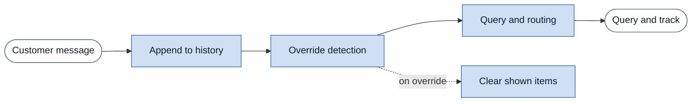
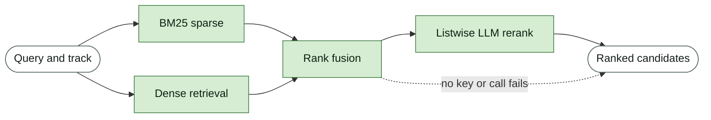

# Conversational Retrieval Agent, TechJam 2026 Track 4

> **Repository layout.** The agent lives in `starter/`, which is what `evaluator/local_evaluator.py` imports, so every command below and every number in Results is
> reproduced from there. `submission/` is the same code packaged in the layout recommended by
> `docs/submission_rules.md`, regenerated by `python sync_submission.py`.


## Problem

A simulated shopper looks for one specific product in a frozen 50,000-item Amazon clothing
catalog, describing it a few facts at a time. Each turn the agent returns ten `parent_asin` values
and may ask one clarifying question. A session lasts at most 10 turns.

Scoring is `0.50 x Hit@10 + 0.30 x MRR + 0.20 x Efficiency`, where
`Efficiency = clip((11 - MTTC) / 10, 0, 1)` and MTTC is the mean turn of first hit. The provided
BM25 baseline scores `0.10671`.

## Project overview

### Architecture


Each stage is broken out below.

### Core components

The three stages run in order every turn. Dialogue converts the conversation so far into one search
query. Retrieval converts that query into a ranked candidate list. Control selects the ten items to
return and decides what to ask next, which determines what the shopper reveals on the following
turn and therefore what Dialogue has to work with.

#### Dialogue

Conversation is turned into a query. The shopper reveals facts only when asked, and never repeats
one, so this stage exists to capture each fact once and keep it for the rest of the session.



**Message history.** Every customer message is appended to a list, and the whole list is joined
into one query string. Each fact is disclosed once and never repeated, so an agent that searches
only the newest message discards what earlier turns obtained. The disclosed text comes from the
target product's own `features` and `details` fields, so the accumulated query is close to verbatim
catalog text.

**Intent override detection.** A lexical cue such as "actually" or "instead" marks an override. The
agent clears the set of already-shown items but keeps the accumulated query, because the abandoned
preference still describes the target.

**Dual-track routing.** Prices, sizes and brand words mark a buying turn, everything else browsing.
The label selects the fusion weights in the next stage, so buying turns lean on literal matching
and browsing turns lean on meaning.

#### Retrieval

Turns the query into a ranked candidate list. Two independent routes run over the same query and
are merged, then the top of the merged list is reordered.



**BM25 sparse retrieval.** Reusing the starter agent provided. SQLite FTS5 over seven catalog fields with per-field weights. Because
disclosed constraints are near-verbatim catalog text, lexical matching is the dominant signal.

**Dense retrieval and fusion.** `BAAI/bge-small-en-v1.5` bi-encoder encodes the query, compared against 50,000
precomputed normalised vectors by exact cosine similarity. The two ranked lists merge with
reciprocal rank fusion, which combines by rank position because BM25 scores and cosine similarities
are not on a comparable scale. Fusion weights depend on the track chosen by Dialogue.

**Listwise LLM reranking.** The top 20 candidates are described to the model in one call, numbered,
and returned as a reordered permutation at `temperature=0`. This follows permutation generation, the
core technique from RankGPT (Sun et al., EMNLP 2023, arXiv:2304.09542). Reranking is what moves
MRR.

A two-window sliding pass over the top 30, closer to full RankGPT, was measured. It improved Hit@10
and MTTC but lost MRR, for a net score change within run-to-run variance, at roughly twice the
tokens and twice the latency. The single window ships on cost. Reproduce with `RERANK_DEPTH=30`.

#### Control

Selects what to return and what to ask. This stage decides the shape of the next turn, so it
closes the loop back into Dialogue.


**Catalog ID validation and never-empty guarantee.** Returned identifiers are checked against the
catalog, then backfilled from the current candidates, the previous ranking, and a warm-up list
captured at startup. No configuration returns fewer than ten results.

**Unseen-first paging.** Items already shown are pushed behind unseen ones, so ten turns of ten
results reach up to 100 distinct products instead of repeating one page.

**Ask policy.** The agent sets `ask_attribute="other"` every turn. The simulated shopper discloses
information only when asked. With `ask_attribute=None` it returns a fixed sentence carrying no
information, so the query never changes and every turn repeats the first. `"other"` returns the
next two undisclosed constraints of any type, a superset of what any single-attribute question
returns. This is the largest single contributor to the score.

### The offline fallback

The dashed edge in the Retrieval diagram is the fallback: the fused reciprocal-rank-fusion order,
passed through unchanged when the reranker cannot run. It is a valid ranking, not a crash path,
but it is measurably weaker than the shipped configuration and is a last resort rather than an
equivalent mode. Three conditions trigger it:

1. `RERANK_MODEL` is unset, which is the state of a fresh clone with no API key. No call is
   attempted and no tokens are used.
2. Any API call raises, including a bad key, rate limit, timeout, or network failure. The agent
   prints one line to stderr, disables reranking for the rest of the process, and continues on the
   fused order.
3. The model returns a malformed reply. `parse_order` keeps only valid in-range indices and
   backfills the rest, so a garbage response degrades to a partial reordering rather than dropping
   or duplicating a product.

If the embedding index is also missing, `interface.init` catches it, prints a warning naming the
build command, and runs BM25 only. There is no configuration in which the agent fails to return ten
results.

## Setup and installation

Python 3.11 or newer, developed and measured on 3.12.10.

### From a fresh clone, start to finish

```bash
git clone <repo-url>
cd techjam26_inittowinit

python -m venv .venv
.venv/Scripts/activate            # Windows
# source .venv/bin/activate       # macOS or Linux

pip install -r requirements.txt

# catalog: download catalog.jsonl.gz from the challenge GitHub Release,
# decompress to data/catalog.jsonl (50,000 rows)

python -m starter.src.index_build          # encoder + embeddings, ~3 min, once
cp .env.example .env                       # then paste your API key into .env
python -m evaluator.local_evaluator        # writes results.json
```

Expect `0.828623` with a key configured, `0.800304` without. Each step is explained below.

Asset paths resolve against the package rather than the working directory, so the agent can be
imported and run from anywhere once the index is built.

### 1. Catalog

Not committed. Download `catalog.jsonl.gz` from the challenge GitHub Release and decompress it to
`data/catalog.jsonl` (50,000 rows). The path is read from `CATALOG_PATH`.

### 2. Dependencies

```bash
pip install -r requirements.txt
```

Pulls CPU-only PyTorch, about 200MB rather than 2.5GB. No GPU required.

### 3. Embedding index

```bash
python -m starter.src.index_build
```

Downloads the encoder (about 130MB) and writes `starter/assets/embeddings.npy` (50000 x 384),
`asins.json` and `meta.json`. Needs network once. Idempotent, skips if the index already matches,
`--force` rebuilds.

**Required for the shipped configuration.** Hybrid retrieval needs this index. Large assets are not
committed to the repository; they are produced by this documented command and loaded from disk at
startup rather than recomputed.

*Fallback if you skip it or the download fails:* `interface.init` catches the missing index, prints
a warning naming this command, and the agent runs BM25 sparse retrieval only. The run completes and
scores, but without the dense route.

### 4. LLM API key

**Required for the shipped configuration.** Reranking stays off until a model is configured, and
without it the agent scores `0.028` lower.

```bash
cp .env.example .env
```

Edit `.env`, uncomment one provider block, and paste your key:

```
RERANK_MODEL=openai/gpt-4o-mini
OPENAI_API_KEY=sk-...
```

Any [litellm](https://docs.litellm.ai/docs/providers)-supported provider works. The model string
selects the provider, so `gemini/gemini-3.6-flash` with `GEMINI_API_KEY`, or
`groq/llama-3.3-70b-versatile` with `GROQ_API_KEY`, need no code change.

A full 200-session evaluation costs about $0.10 on `openai/gpt-4o-mini`.

*Fallback if you have no key, or a call fails mid-run:* the agent prints one line to stderr and
ranks on the fused retrieval order instead. The run completes and scores `0.800304` rather than
`0.828623`, as recorded under Results. This exists so a missing or failing key never breaks a run.
It is not an equivalent configuration.

## Reproducing the results

```bash
python -m evaluator.local_evaluator
```

Writes `results.json` and prints the metrics. After completing all four setup steps this reproduces
the shipped row, `0.828623`. Skipping step 4 reproduces the fallback row, `0.800304`.

To replay one session turn by turn:

```bash
python demo_session.py --scenario intent_override --index 1
```

A captured four-turn override session is saved at [`demo_session.txt`](starter/demo_session.txt). It shows
the target unreachable on turn 1, ranked first on turn 2, pushed to rank 21 by the override on turn
3, and recovered to rank 1 on turn 4.

## Results

The left column is the shipped configuration. The right column is the degraded path taken when no
API key is available, included so the cost of losing it is on record. Both are full 200-session
runs on the same commit with the response cache disabled, so token counts are real rather than
replayed.

| | Shipped | Fallback, no API key |
|---|---|---|
| Model | `openai/gpt-4o-mini` | none |
| **Score** | **0.828623** | **0.800304** |
| Hit@10 | 0.965 | 0.965 |
| MRR | 0.608742 | 0.521012 |
| MTTC | 2.825 | 2.925 |
| Prompt tokens | 514,026 | 0 |
| Completion tokens | 32,068 | 0 |
| Estimated cost | $0.096 per run, $0.0005 per session | $0.00 |
| Latency p50 / p95 | 1188 ms / 1697 ms | 47 ms / 94 ms |
| Wall clock, 200 sessions | 11.6 min | 28.5 s |
| Exceptions | 0 | 0 |

Cost uses gpt-4o-mini list rates of $0.15 per 1M input and $0.60 per 1M output tokens, applied to
the measured counts above. Reranking averages 979 tokens per turn across 558 turns.

**If your token counts come back near zero, check `LLM_CACHE`.** The agent can replay model
responses from a disk cache keyed on the prompt. It exists so repeated evaluator runs stay
comparable while tuning, and it is off by default precisely because a cached run reports only the
tokens it actually spent, understating true cost by orders of magnitude. Every number in the table
above was produced with it off. Setting `LLM_CACHE=1` reproduces the score far faster and for free,
but the resulting `reported_token_usage` is not a cost measurement and should not be read as one.

Startup is about 17s in both rows, loading the encoder and the embedding matrix. It is excluded
from per-turn latency because it happens once per process, not per session.

Reranking buys `+0.028` score, almost entirely MRR, for 25x per-turn latency and about ten cents
per evaluation.

## Limitations

- **Reranking is not bit-deterministic.** Replaying cached model responses scored `0.830369` while
  a fresh sampling of the same prompts at `temperature=0` scored `0.828623`. The cold number is
  published. Expect run-to-run variation of roughly `0.002`.
- **Slot values do not affect the score.** Dialogue state tracking is implemented, but the query is
  built from raw message history, so `NO_SLOTS=1` reproduces the score exactly. Slot state
  influences only the shown-item reset on override.
- **Override detection is a keyword match.** It fires on "actually", which the evaluator hardcodes
  into every override message and generates from frozen code rather than storing in session data.
  A paraphrased override on the private set would cost up to `0.104`. A cue-independent fallback
  (`KEEP_TOP=2`) was measured and recovers most of that, but costs `0.025` when detection works, so
  it is not shipped.
- **Hit@10 is structurally capped near `0.975`.** Five targets sit at true ranks 110 to 315, past
  the 100 items any 10-turn session can display. Neither reranking nor better dialogue reaches them.
- **Attribute extraction covers colour and material only**, by regex over a closed vocabulary. The
  catalog has no `color` or `material` field; both exist in free text only.


## Tech stack

| Layer | Choice |
|---|---|
| Language | Python 3.12.10 |
| Sparse retrieval | SQLite FTS5 with BM25 ranking, standard library |
| Dense retrieval | `sentence-transformers` 6.0.0, `BAAI/bge-small-en-v1.5`, pinned revision |
| Vectors | `numpy` 2.5.2, exact cosine over a 50000 x 384 matrix |
| Compute | `torch` 2.13.0+cpu, CPU only |
| LLM routing | `litellm` 1.98.0, provider selected by model string |
| Reranking model | `openai/gpt-4o-mini` |
| Configuration | `python-dotenv` 1.2.3 |

No vector database, no agent framework, no fine-tuning, no training.

## Team contributions

- **Yong Zhuo**, retrieval: BM25 index, dense retrieval, RRF fusion, offline index build, reranking.
- **Christopher**, dialogue: control policy, dialogue state tracking, query construction, ask policy,
  routing, guardrails, evaluation harness, failure analysis.
