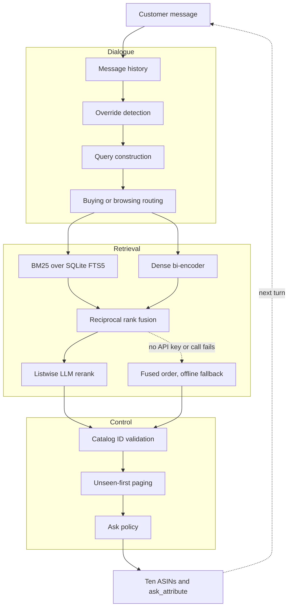

# Conversational Retrieval Agent, TechJam 2026 Track 4

## Problem

A simulated shopper looks for one specific product in a frozen 50,000-item Amazon clothing
catalog, describing it a few facts at a time. Each turn the agent returns ten `parent_asin` values
and may ask one clarifying question. A session lasts at most 10 turns.

Scoring is `0.50 x Hit@10 + 0.30 x MRR + 0.20 x Efficiency`, where
`Efficiency = clip((11 - MTTC) / 10, 0, 1)` and MTTC is the mean turn of first hit. The provided
BM25 baseline scores `0.10671`.

## Project overview

### Architecture



### Core components

**Ask policy.** The agent sets `ask_attribute="other"` every turn. The simulated shopper discloses
information only when asked. With `ask_attribute=None` it returns a fixed sentence carrying no
information, so the query never changes and every turn repeats the first. `"other"` returns the
next two undisclosed constraints of any type, a superset of what any single-attribute question
returns. This is the largest single contributor to the score.

**Message history.** Every customer message is appended to a list, and the whole list is joined
into one query string. Each fact is disclosed once and never repeated, so an agent that searches
only the newest message discards what earlier turns obtained. The disclosed text comes from the
target product's own `features` and `details` fields, so the accumulated query is close to verbatim
catalog text.

**Intent override detection.** A lexical cue such as "actually" or "instead" marks an override. The
agent clears the set of already-shown items but keeps the accumulated query, because the abandoned
preference still describes the target. Removing this costs `0.104` and drops `intent_override`
Hit@10 from `0.933` to `0.100`.

**Unseen-first paging.** Items already shown are pushed behind unseen ones, so ten turns of ten
results reach up to 100 distinct products instead of repeating one page.

**BM25 sparse retrieval.** SQLite FTS5 over seven catalog fields with per-field weights. Because
disclosed constraints are near-verbatim catalog text, lexical matching is the dominant signal. BM25
alone reaches recall `1.000` at depth 500.

**Dense retrieval and fusion.** `BAAI/bge-small-en-v1.5` encodes the query, compared against 50,000
precomputed normalised vectors by exact cosine similarity. The two ranked lists merge with
reciprocal rank fusion, which combines by rank position because BM25 scores and cosine similarities
are not on a comparable scale. Fusion weights depend on the buying or browsing track.

**Listwise LLM reranking.** The top 20 candidates are described to the model in one call, numbered,
and returned as a reordered permutation at `temperature=0`. This is permutation generation, the
core technique from RankGPT (Sun et al., EMNLP 2023, arXiv:2304.09542). Reranking is what moves
MRR, from `0.521` to `0.609`.

A two-window sliding pass over the top 30, closer to full RankGPT, was measured. It improved Hit@10
(`0.965` to `0.970`) and MTTC (`2.825` to `2.76`) but lost MRR (`0.609` to `0.592`), for a net
score change of `-0.0013` at 1.95x the tokens and 1.87x the latency. That difference is smaller
than the run-to-run variance in Limitations, so the single window ships on cost. Reproduce with
`RERANK_DEPTH=30`.

### Retrieval flow and the offline fallback

```
query -> BM25 top 120  ----\
                            >-- reciprocal rank fusion -- top 120
query -> dense top 120 ----/                |
                                            v
                              RERANK_MODEL set and call succeeds?
                                   |                      |
                                  yes                     no
                                   |                      |
                          listwise LLM rerank      fused order unchanged
                                   |                      |
                                   \----------> ten ASINs after paging
```

The fallback is the fused reciprocal-rank-fusion order, which is a complete working ranking on its
own rather than a degraded mode. Three conditions trigger it:

1. `RERANK_MODEL` is unset, which is the state of a fresh clone with no API key. No call is
   attempted and no tokens are used.
2. Any API call raises, including a bad key, rate limit, timeout, or network failure. The agent
   prints one line to stderr, disables reranking for the rest of the process, and continues on the
   fused order.
3. The model returns a malformed reply. `parse_order` keeps only valid in-range indices and
   backfills the rest, so a garbage response degrades to a partial reordering rather than dropping
   or duplicating a product.

If the embedding index is also missing, `interface.init` catches it, prints a warning naming the
build command, and runs BM25 only. There is no configuration in which the agent fails to return ten
results.

## Setup and installation

Python 3.11 or newer, developed and measured on 3.12.10. All commands run from the repository root.

### 1. Catalog

Not committed. Download `catalog.jsonl.gz` from the challenge GitHub Release and decompress it to
`data/catalog.jsonl` (50,000 rows). The path is read from `CATALOG_PATH`.

### 2. Dependencies

```bash
pip install -r requirements.txt
```

Pulls CPU-only PyTorch, about 200MB rather than 2.5GB. No GPU required.

### 3. Embedding index

```bash
python -m starter.src.index_build
```

Downloads the encoder (about 130MB) and writes `starter/assets/embeddings.npy` (50000 x 384),
`asins.json` and `meta.json`. Needs network once. Idempotent, skips if the index already matches,
`--force` rebuilds.

Large assets are not committed. They are produced by this documented command and loaded from disk
at startup rather than recomputed.

This step is optional. Without it the agent prints a warning and runs BM25 only.

### 4. LLM API key, optional

Reranking stays off until a model is configured.

```bash
cp .env.example .env
```

Edit `.env`, uncomment one provider block, and paste your key:

```
RERANK_MODEL=openai/gpt-4o-mini
OPENAI_API_KEY=sk-...
```

Any [litellm](https://docs.litellm.ai/docs/providers)-supported provider works. The model string
selects the provider, so `gemini/gemini-3.6-flash` with `GEMINI_API_KEY`, or
`groq/llama-3.3-70b-versatile` with `GROQ_API_KEY`, need no code change.

**Without a key the agent runs normally.** No call is attempted, no tokens are used, and ranking
falls back to the fused retrieval order. Both configurations are measured below.

## Reproducing the results

```bash
python -m evaluator.local_evaluator
```

Writes `results.json` and prints the metrics. With no `.env` present this reproduces the offline
row. With `RERANK_MODEL` and a key set it reproduces the reranked row.

To replay one session turn by turn:

```bash
python demo_session.py --scenario intent_override --index 1
```

A captured four-turn override session is saved at [`demo_session.txt`](demo_session.txt). It shows
the target unreachable on turn 1, ranked first on turn 2, pushed to rank 21 by the override on turn
3, and recovered to rank 1 on turn 4.

## Results

Both rows are full 200-session runs on the same commit with the response cache disabled, so token
counts are real rather than replayed.

| | Reranked | Offline fallback |
|---|---|---|
| Model | `openai/gpt-4o-mini` | none |
| **Score** | **0.828623** | **0.800304** |
| Hit@10 | 0.965 | 0.965 |
| MRR | 0.608742 | 0.521012 |
| MTTC | 2.825 | 2.925 |
| Prompt tokens | 514,026 | 0 |
| Completion tokens | 32,068 | 0 |
| Estimated cost | $0.096 per run, $0.0005 per session | $0.00 |
| Latency p50 / p95 | 1188 ms / 1697 ms | 47 ms / 94 ms |
| Wall clock, 200 sessions | 11.6 min | 28.5 s |
| Exceptions | 0 | 0 |

Cost uses gpt-4o-mini list rates of $0.15 per 1M input and $0.60 per 1M output tokens, applied to
the measured counts above. Reranking averages 979 tokens per turn across 558 turns.

Startup is about 17s in both rows, loading the encoder and the embedding matrix. It is excluded
from per-turn latency because it happens once per process, not per session.

Reranking buys `+0.028` score, almost entirely MRR, for 25x per-turn latency and about ten cents
per evaluation.

## Limitations

- **Reranking is not bit-deterministic.** Replaying cached model responses scored `0.830369` while
  a fresh sampling of the same prompts at `temperature=0` scored `0.828623`. The cold number is
  published. Expect run-to-run variation of roughly `0.002`.
- **Slot values do not affect the score.** Dialogue state tracking is implemented, but the query is
  built from raw message history, so `NO_SLOTS=1` reproduces the score exactly. Slot state
  influences only the shown-item reset on override.
- **Override detection is a keyword match.** It fires on "actually", which the evaluator hardcodes
  into every override message and generates from frozen code rather than storing in session data.
  A paraphrased override on the private set would cost up to `0.104`. A cue-independent fallback
  (`KEEP_TOP=2`) was measured and recovers most of that, but costs `0.025` when detection works, so
  it is not shipped.
- **Hit@10 is structurally capped near `0.975`.** Five targets sit at true ranks 110 to 315, past
  the 100 items any 10-turn session can display. Neither reranking nor better dialogue reaches them.
- **Attribute extraction covers colour and material only**, by regex over a closed vocabulary. The
  catalog has no `color` or `material` field; both exist in free text only.
- **Measured on the 200 public sessions with no held-out set.** The private 800 share the same
  generator and scenario mix, but transfer cannot be confirmed before submission.

## Tech stack

| Layer | Choice |
|---|---|
| Language | Python 3.12.10 |
| Sparse retrieval | SQLite FTS5 with BM25 ranking, standard library |
| Dense retrieval | `sentence-transformers` 6.0.0, `BAAI/bge-small-en-v1.5`, pinned revision |
| Vectors | `numpy` 2.5.2, exact cosine over a 50000 x 384 matrix |
| Compute | `torch` 2.13.0+cpu, CPU only |
| LLM routing | `litellm` 1.98.0, provider selected by model string |
| Reranking model | `openai/gpt-4o-mini` |
| Configuration | `python-dotenv` 1.2.3 |

No vector database, no agent framework, no fine-tuning, no training.

## Team contributions

- **Person A**, retrieval: BM25 index, dense retrieval, RRF fusion, offline index build, reranking.
- **Person B**, dialogue: control policy, dialogue state tracking, query construction, ask policy,
  routing, guardrails, evaluation harness, failure analysis.
